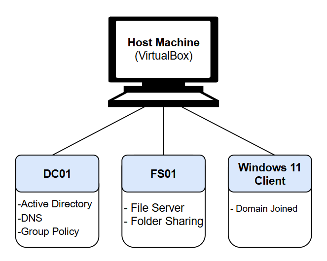
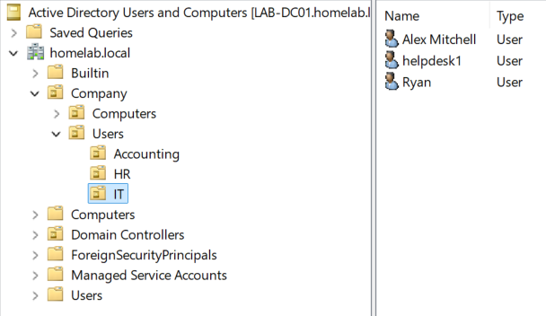
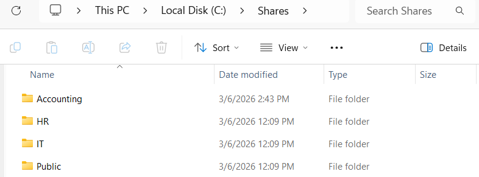
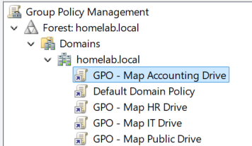

# Active-Directory-Homelab

This project demonstrates the deployment and administration of a Windows Server Active Directory environment using virtual machines.

The lab simulates a small company network with a domain controller, file server, and domain-joined client machine. 

## Network Architecture

This lab environment was created using Oracle VirtualBox and consists of three virtual machines connected through an internal virtual network.

## Active Directory Structure

Security groups are used to control access to shared resources and administrative permissions. 

## File Server Configuration

|Share Path            |Access Group  |
|----------------------|--------------|
|\\LAB-FS01\HR         |HR_SG         |
|\\LAB-FS01\ACCOUNTING |Accounting_SG |
|\\LAB-FS01\IT         |IT_SG         |
|\\LAB-FS01\Public     |Domain Users  |

Permissions were configured using both **share permissions and NTFS permissions**.

## Group Policy Configuration

Group Policy was used to automate administrative tasks and enforce security policies. 
Network drives are automatically mapped for users based on department membership. 
Drive mapping is implemented using **Group Policy Preferences with item-level targeting**.

## Password Policy
- Minimum password length: 10 characters
- Password complexity enabled
- Password history enforced

## Account Lockout Policy
- Lock account after 5 failed attempts
- Reset lockout counter after 15 minutes

## Helpdesk Delegation
A Helpdesk security group was created and granted limited administrative permissions. 

Helpdesk users are able to: 
- Reset user passwords
- Unlock user accounts
- Force password reset at next login

This was configured using the **Delegation of Control Wizard in Active Directory**. 

## Troubleshooting Experience
During the setup of this environment, several common IT issues were diagnosed and resolved:
- DNS configuration preventing domain joins
- VirtualBox network misconfiguration (NAT vs Internal Network)
- Group Policy drive mapping conditions
- Active Directory DNS record registration

# Skills Demonstrated
- Active Directory administration
- DNS configuration
- Windows Server deployment
- Group Policy management
- Network drive automation
- NTFS and share permissions
- Virtual machine networking
- IT troubleshooting methodology

## Technologies Used
- Windows Server 2025
- Windows 11
- Active Directory Domain Services
- DNS
- Group Policy
- Oracle VirtualBox
